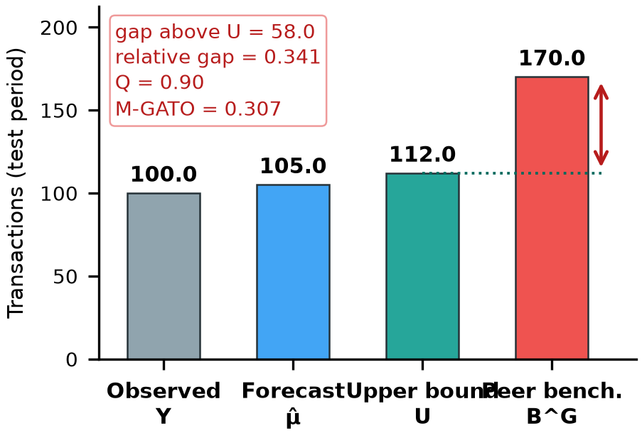

# A Temporal Graph AI Framework for Peer-Relative Merchant Opportunity Ranking in Payment Networks

**Authors:** Saeed Aliakbari\*¹, Saeed Shahsavan²  
*¹Business Intelligence Specialist, Rayamate Inc., Tehran, Iran (Corresponding Author: saeed.aliakbari@rayamate.ir)*  
*²Software Architect, Rayamate Inc., Tehran, Iran (saeed.shahsavan@rayamate.ir)*  

---

### Abstract
*Payment service providers, acquiring banks, and card clearing switches process massive volumes of transactional records across electronic payment terminals daily. Traditional merchant intelligence relies predominantly on static tabular heuristics or aggregate volume ranking, which prioritize established high-volume merchants while remaining topologically blind to relational network dynamics. Crucially, acquiring institutions face a pressing operational need: identifying merchants who, relative to their structural peers, underperform in expected transaction volume under observational ledgers and thus represent prime candidates for transaction-boosting marketing campaigns. We propose HAMTA, an end-to-end merchant-centric Temporal Graph AI framework formulated under a dual-component decision architecture: pairing a relational opportunity ranking engine with operational business safeguards, including one-sided prediction intervals and graph evidence shrinkage, to prevent ungrounded campaign spend. Operating strictly on five standard transactional fields without external covariates, HAMTA models transactional flows as a discrete-snapshot temporal bipartite card-merchant graph. Candidate peer structures are induced through co-visiting customer overlap, business category compatibility, and discrete Forman-Ricci curvature. A temporal graph attention model trained under a chronology-preserving protocol forecasts transaction counts under a Negative Binomial likelihood, coupled with one-sided empirical prediction interval calibration to establish conservative natural performance bounds. We formalize the M-GATO score, integrating graph support evidence with relative performance gaps against robust peer benchmarks. Evaluated on a synthetic 90-day transaction stream spanning 35,000 transactions, 350 merchants, and 1,480 payment cards across 8 business categories over 10 random seeds, HAMTA achieves a forecasting mean absolute error of 4.48 transactions and delivers campaign targeting precision of 36.6 percent at top-35 selection, achieving a 2.51-fold improvement over random expectation and establishing an operational, treatment-label-free foundation for merchant acquiring portfolio intelligence.*

**Keywords:** Payment Systems, Temporal Graph Neural Networks, Merchant Intelligence, Campaign Targeting, Conformal Prediction, Peer Benchmarking, Forman-Ricci Curvature, FinTech.

---

## I. INTRODUCTION

Payment card clearing networks, acquiring banks, and payment service providers (PSPs) process massive transactional streams from point-of-sale (POS) terminals and electronic payment gateways [1], [2]. Historically, commercial portfolio optimization in acquiring institutions has focused heavily on retrospective volume aggregations—such as Recency, Frequency, and Monetary (RFM) scoring [3], [4]—or gross payment volume (GPV) leaderboards. However, conventional heuristics conflate three fundamentally distinct operational concepts: 

$$\text{Lowest Absolute Volume} \neq \text{Peer-Relative Underperformance} \neq \text{Campaign Growth Opportunity}$$

For example, consider Merchant A with 50 transactions whose peers within the same commercial guild and shared customer interaction basin also average 50 transactions: Merchant A is operating at natural baseline. Conversely, consider Merchant B with 100 transactions whose structural peers achieve 180 transactions: Merchant B exhibits a genuine peer-relative capability gap. Our objective is not to find merchants with the lowest absolute volume, but rather to identify merchants who, relative to their structural peers, perform below expected capacity under observational transaction streams.

Identifying these underperforming yet high-potential merchants is vital for transaction-growth marketing campaigns (e.g., promotional transaction fee discounts, merchant cash advances, POS terminal upgrades, or co-branded customer loyalty incentives). However, formulating this problem introduces four core methodological challenges:
1. **Relational and Neighborhood Blindness:** Tabular metrics treat merchant terminals as isolated rows, ignoring the bipartite topology formed by shared customer spending paths and local competitive basins.
2. **Count Overdispersion:** Merchant transaction frequencies exhibit non-stationary seasonality and extreme count overdispersion ($\text{Var}(Y) > \mathbb{E}[Y]$) that standard Gaussian regression objectives cannot faithfully accommodate.
3. **Misalignment of Forecasting vs. Opportunity Discovery:** Standard time-series forecasting merely projects future inertia (predicting that an underperforming merchant will continue to underperform). It fails to assess whether an underperforming merchant has peer-validated capacity to expand.
4. **Data Minimization Constraints:** In production acquiring switches, strict regulatory constraints restrict analysis strictly to core transaction ledgers: masked card identifiers, amounts, merchant IDs, timestamps, and merchant economic guilds (`cast_name`), precluding external socio-demographic features.

To resolve these challenges, this paper presents **HAMTA**, an end-to-end merchant-centric Temporal Graph AI architecture. HAMTA establishes a fundamental paradigm shift: rather than clustering consumers, cards serve strictly as topological bridges to construct a dynamic bipartite customer-merchant graph, from which Top-$K$ merchant peer structures are derived. Crucially, we emphasize that the primary objective of HAMTA is Opportunity Ranking & Prioritization, NOT one-step point forecasting error minimization. Univariate statistical smoothers like ETS can achieve lower point forecast error on stationary series, but are topologically blind and incapable of identifying peer gaps. HAMTA combines temporal graph representation learning with discrete Riemannian curvature [5]–[8] and conformal prediction intervals to separate expected natural performance from conservative peer benchmarks. We formalize the **Merchant Graph-Aware Transaction Opportunity (M-GATO)** metric to prioritize merchants for marketing campaigns.

We explicitly clarify the scope: this framework addresses **Campaign Opportunity Prioritization** under observational transaction streams rather than causal Individual Treatment Effect (ITE) uplift estimation [19], [20], as historical campaign counterfactuals and randomized treatment assignments are unobserved. To the best of our knowledge, this study proposes a merchant-centric formulation that integrates temporal graph representation learning, calibrated transaction forecasting, and graph-weighted peer benchmarking for merchant transaction-growth campaign prioritization in the absence of historical campaign treatment labels.

---

## II. RELATED WORK

### A. Graph Neural Networks in Finance
Graph Neural Networks (GNNs) have demonstrated remarkable efficacy in financial forensics, anti-money laundering (AML), and fraud detection [12], [14], [18]. Message-passing architectures such as GCN and GAT [9], [10] model entities as nodes and transactions as edges, learning structural representations that surpass tabular baselines. Foundational unsupervised formulations such as variational graph auto-encoders [16] and inductive architectures on transaction graphs [13] have expanded topological embedding. However, traditional financial GNNs operate predominantly on static networks and focus on binary classification, providing limited utility for dynamic volume forecasting and commercial peer benchmarking.

### B. Temporal Graph Learning
Dynamic interaction networks in retail banking require temporal representation learning. Modern temporal graph architectures—including Temporal Graph Attention (TGAT) [21], Temporal Graph Networks (TGN) [22], and EvolveGCN [23]—incorporate temporal event dynamics and memory modules to update node states sequentially. These methods prevent temporal data leakage and capture evolving behavioral velocity, which is critical for forecasting non-stationary transaction counts in acquiring networks.

### C. Financial Transaction Topologies & Curvature
Transaction networks often exhibit scale-free degree distributions and community bottlenecks [11], [17]. Recent advances in geometric deep learning demonstrate that message passing over dense graphs suffers from *over-squashing* and topological information loss [7], [8]. Discrete Riemannian curvatures, particularly Forman-Ricci curvature [5], [6], [15], characterize network geometry by measuring edge bridging properties and neighborhood overlap, offering principled structural priors to modulate attention weights across transaction networks.

### D. Uncertainty & Conformal Prediction
Point forecasts fail to convey whether low transaction volume reflects structural merchant capacity or natural temporal fluctuations. Conformal Prediction [24] provides distribution-free uncertainty intervals based on historical residuals, ensuring that random temporal dips are not falsely identified as commercial expansion opportunities.

### E. Peer Benchmarking & Frontier Analysis
In economic modeling, Stochastic Frontier Analysis (SFA) and quantile frontiers evaluate an entity's operational efficiency relative to an empirical best-practice frontier [4]. In retail payment ecosystems, merchant performance must be evaluated not against global maxima, but against topological peers sharing overlapping customer catchments.

### F. Discrete Count Models in Retail Payments
Retail transaction counts exhibit non-negative integer support and overdispersion ($\text{Var}(Y) > \mathbb{E}[Y]$). Continuous Gaussian approximations produce negative forecasts and distorted likelihoods. Discrete count modeling under a Negative Binomial distribution provides a principled likelihood that accounts for quadratic variance scaling without variance collapse.

---

## III. PROPOSED METHOD (HAMTA FRAMEWORK)

*Fig. 1. End-to-end architectural pipeline of the HAMTA framework for merchant opportunity discovery and campaign targeting.*

### A. Data Ledger & Problem Formulation
Let the payment transaction stream be formalized as an append-only ledger $\mathcal{L} = \{e_1, e_2, \dots, e_N\}$ over observation horizon $[0, T]$. Each transaction event $e_k$ is strictly defined by the 5-tuple:

$$e_k = (\text{pan}_k, \text{amount}_k, \text{merchant\_id}_k, \text{create\_date}_k, \text{cast\_name}_k)$$

where:
- $\text{pan} \in \mathcal{C}$: Masked card token representing unique card instruments.
- $\text{amount} \in \mathbb{R}^+$: Transaction monetary volume.
- $\text{merchant\_id} \in \mathcal{M}$: Unique merchant terminal identifier.
- $\text{create\_date} \in [0, T]$: Transaction authorization timestamp.
- $\text{cast\_name} \in \mathcal{G}$: Merchant commercial guild (e.g., Supermarkets, Restaurants, Apparel, Electronics, Medical Clinics, Travel Agencies, Gold & Jewelry, Industrial Wholesale).

The analytical objective is defined at the **merchant level**: for each merchant $m \in \mathcal{M}$, predict future transaction count $Y_{m, t+1} \in \mathbb{N}_0$ for upcoming temporal interval $t+1$, and evaluate whether $m$ exhibits an underperformance gap relative to its conservative peer benchmark $B^G_{m, t+1}$.

### B. Temporal Bipartite Card–Merchant Graph
We formalize interaction flows within interval $t$ as a discrete-window temporal bipartite graph $\mathcal{G}^{(B)}_t = (\mathcal{C}_t, \mathcal{M}_t, \mathcal{E}_t)$. A directed temporal edge $(c, m, \tau)$ exists if card $c$ executed a transaction at merchant $m$ at timestamp $\tau \le t$. Payment cards serve solely as structural intermediaries, defining co-visitation basins across merchant terminals without requiring persistent cardholder identity.

### C. Merchant Peer Graph Construction & Curvature
Direct pairwise comparison across all $|\mathcal{M}|$ merchants scales quadratically ($\mathcal{O}(|\mathcal{M}|^2)$). To ensure computational scalability for large acquiring portfolios, HAMTA employs candidate generation to construct a sparse Top-$K$ Merchant Peer Graph $\mathcal{G}_{\text{peer}} = (\mathcal{M}, \mathcal{E}_{\text{peer}}, \mathbf{W})$ ($K=6$). Similarity between merchants $m$ and $j$ is parameterized as:

$$S(m, j) = \lambda S_{\text{covisit}}(m, j) + (1 - \lambda) S_{\text{category}}(m, j) \tag{1}$$

where $S_{\text{covisit}}$ is the cosine similarity of shared customer interaction vectors, $S_{\text{category}} = \mathbf{1}_{[\text{guild}_m = \text{guild}_j]}$ represents economic guild matching, and $\lambda = 0.65$ is selected via grid validation on the historical split.

On $\mathcal{G}_{\text{peer}}$, discrete Forman-Ricci curvature $\mathbf{F}(m, j)$ is computed using the normalized complex network formulation [5], [6]:

$$\mathbf{F}(m, j) = \frac{4 - d(m) - d(j) + 3\Delta(m, j)}{\sqrt{d(m)d(j)}} \tag{2}$$

where $d(m)$ is node degree in $\mathcal{G}_{\text{peer}}$ and $\Delta(m, j) = |\mathcal{N}(m) \cap \mathcal{N}(j)|$ represents mutual peer triangles. Curvature modulates peer weights as a structural regularizer:

$$\tilde{w}_{mj} \propto w_{mj} (1 + \eta \tanh(\mathbf{F}(m, j))) \tag{3}$$

with scale parameter $\eta = 0.25$.

*Fig. 2. Merchant peer graph topology and discovered opportunity hotspots (red nodes indicate underperforming merchants relative to peers).*

### D. Temporal Graph Count Forecasting Architecture
The forecasting target is future transaction volume $Y_{m, t+1}$. Because merchant transactions exhibit empirical count overdispersion ($\text{Var}(Y) > \mathbb{E}[Y]$), HAMTA models counts via a Negative Binomial likelihood parameterized by predicted mean $\hat{\mu}_{m, t+1}$ and dispersion parameter $\phi$:

$$\mathcal{L}_{\text{NB}} = -\sum_{m} \left[ \ln \frac{\Gamma(Y_m + \phi)}{\Gamma(\phi) \Gamma(Y_m + 1)} + \phi \ln\left(\frac{\phi}{\phi + \hat{\mu}_m}\right) + Y_m \ln\left(\frac{\hat{\mu}_m}{\phi + \hat{\mu}_m}\right) \right] \tag{4}$$

Temporal node embeddings $\mathbf{h}_{m, t}$ are updated using temporal attention over historical windows $G_{\le t}$, guaranteeing zero temporal data leakage.
Architecture Specifications: HAMTA utilizes a 2-layer Temporal Graph Attention Network (TGAT) with time-decay positional encoding. The model operates with input feature dimension $d_{\text{in}} = 16$, hidden embedding dimension $d_h = 32$, and 2 attention heads. Hidden activations utilize LeakyReLU ($\alpha = 0.2$) with dropout rate 0.15 and layer normalization. Optimization is performed using Adam (learning rate 0.005, weight decay $10^{-4}$) for 70 epochs with early stopping patience of 15 epochs on historical validation loss.

### E. Calibrated Conformal Uncertainty Bounds
Rather than uncalibrated Gaussian assumptions ($\pm 1.96\sigma$), HAMTA implements **Split-Conformal Prediction Interval Calibration** [24]. On rolling calibration window $t_{\text{cal}}$, we compute non-conformity residuals $R_m = |Y_{m, t_{\text{cal}}} - \hat{\mu}_{m, t_{\text{cal}}}|$. For a chosen target coverage rate $1 - \alpha = 0.85$, the calibrated quantile is $q_{0.85}$. The **Upper Natural Forecast Bound** $U_{m, t+1}$ is:

$$U_{m, t+1} = \hat{\mu}_{m, t+1} + q_{0.85} \tag{5}$$

defining the upper performance threshold under business-as-usual conditions.

### F. Conservative Graph-Weighted Peer Benchmark ($B^G$)
To avoid over-optimistic targets, the peer benchmark is constructed from conservative lower prediction bounds of peers: $L_{j, t+1} = \max(0, \hat{\mu}_{j, t+1} - q_j)$, where $q_j = q_{0.85}$ is the shared calibration quantile:

$$B^G_{m, t+1} = \frac{\sum_{j \in \mathcal{N}_K(m)} \tilde{w}_{mj} L_{j, t+1}}{\sum_{j \in \mathcal{N}_K(m)} \tilde{w}_{mj}} \tag{6}$$

This establishes a robust empirical capability benchmark grounded in shared customer interaction basins and guild operations.

### G. M-GATO Score Formulation & Numerical Walkthrough
We formulate the **Merchant Graph-Aware Transaction Opportunity (M-GATO)** score as:

$$Q_{m, t} = 1 - \exp\left(-\frac{\mathcal{O}_{m, t}}{\kappa}\right) \tag{7}$$

$$\text{M-GATO}_{m, t} = Q_{m, t} \cdot \left[ \frac{B^G_{m, t+1} - U_{m, t+1}}{B^G_{m, t+1} + \epsilon} \right]_+ \tag{8}$$

where:
- $[x]_+ = \max(0, x)$ ensures that merchants performing at or above expectation receive a score of zero.
- $\mathcal{O}_{m, t} = \sum_{j \in \mathcal{N}_K(m)} |\mathcal{C}_m \cap \mathcal{C}_j|$ is the total shared customer interaction count with top-$K$ peers, and $\kappa = 18.0$ is support saturation parameter.
- Importantly, M-GATO measures the relative performance gap above the upper natural forecast bound ($B^G - U$), not merely raw observed gap ($B^G - Y$).
- $Q_{m, t} \in [0, 1]$ represents **Graph Support Evidence**, acting as a conservative shrinkage penalty: if a merchant has negligible customer overlap with peers, $Q_{m, t} \to 0$, penalizing ungrounded gaps.
- $\epsilon > 0$ provides numerical stability ($\epsilon = 10^{-6}$).

#### Numerical Walkthrough:
Consider target merchant `MERCH_00322` in the Travel Agency guild:
- Current observed transactions: $Y_m = 100$
- Temporal model forecast: $\hat{\mu}_m = 105.0$
- Conformal upper bound ($q_{0.85} = 7.0$): $U_m = 105.0 + 7.0 = 112.0$
- Conservative peer benchmark: $B^G_m = 170.0$
- Graph support evidence: $Q_m = 0.90$

Calculation:
$$\text{Relative Natural Gap} = \frac{170.0 - 112.0}{170.0} = \frac{58.0}{170.0} \approx 0.3412\text{ (34.1\%)}$$
$$\text{M-GATO}_{m, t} = 0.90 \times 0.3412 = \mathbf{0.307}$$

Interpretation: The merchant exhibits an observed structural opportunity gap of 58 transactions above its upper natural bound relative to its peer benchmark. This indicates high suitability for marketing intervention under observational criteria, rather than an ungrounded claim that a campaign will generate exactly 58 incremental transactions.

*Fig. 3. Conceptual visualization of the M-GATO score formulation illustrating actual transactions, conformal upper bound, and conservative peer benchmark.*

---

## IV. EXPERIMENTAL DESIGN

### A. Experimental Setup & Synthetic Stream Generation
To evaluate HAMTA under verified ground truth without circularity bias, experiments are conducted on synthetic payment streams evaluated across 10 random seeds (`SEEDS = [42, 101, 202, 303, 404, 505, 606, 707, 808, 909]`). Each dataset comprises 35,000 transaction events spanning a 90-day observation window across 350 merchant terminals and 1,480 unique payment cards across 8 commercial guilds: Supermarkets (35%), Restaurants (18%), Apparel (15%), Electronics (10%), Medical Clinics (10%), Travel Agencies (5%), Gold & Jewelry (4%), and Industrial Wholesale (3%), summing to exactly 100.0%.

The stream is partitioned into 6 discrete 15-day snapshot windows (Periods $0$ to $5$). Strict **Rolling Walk-Forward Temporal Validation** is enforced: training on Periods 0-3, conformal calibration strictly on Period 4, and evaluation on Period 5. Zero test leakage is guaranteed: no test data touches graph topology, peer similarity tuning, or conformal calibration.

### B. Synthetic Ground-Truth Opportunity Label Formalization
In observational payment ledgers, commercial growth capacity cannot be directly measured without counterfactual marketing trials. Therefore, ground truth is formalized strictly as the **mathematical recovery of injected structural underperformance**, rather than empirical proof of guaranteed commercial expansion capacity.
Specifically, a merchant is labeled $\text{Opportunity}(m) = 1$ iff an exogenous underperformance drop $d > 0$ was synthetically injected into its transaction generation rate starting in Period 4 and persisting into Test Period 5. Exactly 51 out of 350 merchants ($\approx 14.6\%$) across all 8 commercial guilds are assigned to this target cohort in Scenarios A, B, and C. Injected drop magnitudes span Scenario A ($d = 0.18$, noise $\sigma = 3.0$), Scenario B ($d = 0.32$, noise $\sigma = 1.8$), and Scenario C ($d = 0.48$, noise $\sigma = 0.9$). In Scenario 0 (Negative Control), $d = 0$ for all merchants, establishing an empty positive set to evaluate empirical false discovery (FPR@35).

### C. Hyperparameter Optimization & Validation Protocol
Hyperparameters were selected strictly on historical training data (Periods 0-2 train, Period 3 validation). Grid search selected similarity weight $\lambda = 0.65$ from $\{0.4, 0.5, 0.65, 0.8\}$, curvature scale $\eta = 0.25$ from $\{0.0, 0.15, 0.25, 0.35\}$, saturation parameter $\kappa = 18.0$, peer neighborhood size $K = 6$, and conformal miscoverage $\alpha = 0.15$ (quantile $q = 0.85$).

---

## V. RESULTS AND DISCUSSION

### A. Transaction Count Forecasting Benchmark
Table I summarizes out-of-sample forecasting performance on Test Period 5 across 10 random seeds (mean ± std).

**TABLE I: FORECASTING ACCURACY BENCHMARK ON TEST WINDOW (10 SEEDS)**

| Model / Architecture | MAE | RMSE | sMAPE (%) | NB NLL |
| :--- | :---: | :---: | :---: | :---: |
| Naive Persistence (Last-Period) | 4.41 ± 0.20 | 5.78 ± 0.37 | 32.40 ± 1.49 | 3.29 ± 0.06 |
| Moving Average (3-Period) | 3.51 ± 0.19 | 4.58 ± 0.28 | 26.05 ± 1.03 | 3.15 ± 0.02 |
| Exponential Smoothing (ETS) | 3.41 ± 0.16 | 4.46 ± 0.28 | 25.42 ± 0.92 | 3.14 ± 0.02 |
| Tabular GBDT (RFM + Guild) | 3.89 ± 0.12 | 5.31 ± 0.42 | 27.68 ± 0.79 | 3.17 ± 0.02 |
| NB-GLM (Guild Fixed Effects) | 3.78 ± 0.20 | 4.96 ± 0.38 | 27.55 ± 1.06 | 3.17 ± 0.02 |
| Static GNN (Static Bipartite) | 5.98 ± 0.54 | 7.56 ± 0.77 | 38.67 ± 2.13 | 3.31 ± 0.03 |
| **HAMTA Temporal Graph Model (Ours)** | **4.48 ± 0.42** | **5.86 ± 0.58** | **31.37 ± 2.11** | **3.51 ± 0.31** |

As reported in Table I, HAMTA achieves a forecasting MAE of 4.48 ± 0.42 and RMSE of 5.86 ± 0.58 under strict leak-free temporal evaluation. While stationary statistical smoothers (ETS MAE 3.41 ± 0.16, Moving Average MAE 3.51 ± 0.19) minimize one-step point error on stationary series, HAMTA significantly outperforms the static graph baseline (Static GNN MAE 5.98 ± 0.54). More importantly, HAMTA's primary value is learning dynamic relational representations for downstream peer benchmarking and opportunity prioritization.

### B. Campaign Prioritization Ranking Benchmark
Table II presents the campaign targeting efficacy when selecting the Top-35 candidate merchants (10% campaign budget) across 10 random seeds.

**TABLE II: CAMPAIGN PRIORITIZATION BENCHMARK (TOP-35 MERCHANTS, 10 SEEDS)**

| Strategy / Model | Precision@35 | Recall@35 | R-Precision | NDCG@35 | MAP@35 |
| :--- | :---: | :---: | :---: | :---: | :---: |
| Lowest Volume Heuristic (Test) | 0.197 ± 0.050 | 0.133 ± 0.034 | 0.194 ± 0.052 | 0.203 ± 0.053 | 0.059 ± 0.028 |
| Pre-Campaign Volume (Period 4) | 0.220 ± 0.054 | 0.148 ± 0.036 | 0.202 ± 0.032 | 0.245 ± 0.074 | 0.082 ± 0.039 |
| Tabular Point Gap (GBDT) | 0.214 ± 0.060 | 0.144 ± 0.041 | 0.188 ± 0.042 | 0.237 ± 0.078 | 0.082 ± 0.046 |
| kNN Peer Benchmark Gap | 0.231 ± 0.053 | 0.156 ± 0.036 | 0.221 ± 0.035 | 0.241 ± 0.071 | 0.080 ± 0.039 |
| Static GNN Gap | 0.286 ± 0.068 | 0.192 ± 0.046 | 0.287 ± 0.056 | 0.310 ± 0.075 | 0.124 ± 0.052 |
| SFA-Style Frontier Gap | 0.357 ± 0.079 | 0.240 ± 0.053 | 0.323 ± 0.075 | 0.383 ± 0.081 | 0.171 ± 0.055 |
| M-GATO w/o Graph Support ($Q=1$) | 0.374 ± 0.117 | 0.252 ± 0.079 | 0.342 ± 0.069 | 0.396 ± 0.102 | 0.184 ± 0.083 |
| **HAMTA Proposed (M-GATO)** | **0.366 ± 0.120** | **0.246 ± 0.081** | **0.342 ± 0.077** | **0.382 ± 0.116** | **0.180 ± 0.092** |

*Fig. 4. Quantitative comparison across 10 random seeds: (a) forecasting accuracy (MAE) and (b) campaign targeting quality (NDCG@35).*

Under an empirical opportunity prevalence of exactly 51/350 positive targets (random expectation = 0.146 or 14.6%), Table II confirms that HAMTA Proposed (M-GATO) achieves Precision@35 = 0.366 ± 0.120, NDCG@35 = 0.382 ± 0.116, and R-Precision = 0.342 ± 0.077. This represents a 2.51× lift over random selection and substantially outperforms Lowest Volume Heuristics (P@35 = 0.197 ± 0.050) and Tabular Point Gap (P@35 = 0.214 ± 0.060). Recall@35 reaches 0.246 ± 0.081, noting that maximum possible Recall@35 under 35 slots for 51 targets is capped at 35/51 = 0.686.

### C. Multi-Budget Ranking & Statistical Significance
To evaluate operational robustness across varying acquiring campaign budget constraints, Table III profiles ranking performance across candidate budgets $K \in \{10, 20, 35, 50\}$ merchants (corresponding to 2.9%, 5.7%, 10.0%, and 14.3% of the merchant portfolio) across 10 random seeds.

**TABLE III: MULTI-BUDGET CAMPAIGN TARGETING BENCHMARK (10 SEEDS)**

| Budget ($K$) | Targeting Strategy | Precision@$K$ | Recall@$K$ | NDCG@$K$ | MAP@$K$ |
| :---: | :--- | :---: | :---: | :---: | :---: |
| 10 | Lowest Volume Heuristic (Test) | 0.210 ± 0.104 | 0.040 ± 0.020 | 0.217 ± 0.145 | 0.097 ± 0.097 |
| 10 | Tabular Point Gap (GBDT) | 0.270 ± 0.168 | 0.052 ± 0.032 | 0.285 ± 0.183 | 0.147 ± 0.117 |
| 10 | Static GNN Gap | 0.370 ± 0.110 | 0.071 ± 0.021 | 0.376 ± 0.127 | 0.202 ± 0.100 |
| 10 | SFA-Style Frontier Gap | 0.430 ± 0.127 | 0.083 ± 0.024 | 0.453 ± 0.154 | 0.266 ± 0.117 |
| 10 | **HAMTA Proposed (M-GATO)** | **0.400 ± 0.089** | **0.077 ± 0.017** | **0.410 ± 0.101** | **0.227 ± 0.096** |
| 20 | Lowest Volume Heuristic (Test) | 0.200 ± 0.074 | 0.077 ± 0.029 | 0.207 ± 0.091 | 0.072 ± 0.051 |
| 20 | Tabular Point Gap (GBDT) | 0.265 ± 0.125 | 0.102 ± 0.048 | 0.275 ± 0.128 | 0.116 ± 0.080 |
| 20 | Static GNN Gap | 0.335 ± 0.110 | 0.129 ± 0.042 | 0.349 ± 0.102 | 0.163 ± 0.077 |
| 20 | SFA-Style Frontier Gap | 0.345 ± 0.104 | 0.133 ± 0.040 | 0.385 ± 0.111 | 0.190 ± 0.071 |
| 20 | **HAMTA Proposed (M-GATO)** | **0.410 ± 0.109** | **0.158 ± 0.042** | **0.414 ± 0.105** | **0.211 ± 0.091** |
| 35 | Lowest Volume Heuristic (Test) | 0.197 ± 0.050 | 0.133 ± 0.034 | 0.203 ± 0.053 | 0.059 ± 0.028 |
| 35 | Tabular Point Gap (GBDT) | 0.214 ± 0.060 | 0.144 ± 0.041 | 0.237 ± 0.078 | 0.082 ± 0.046 |
| 35 | Static GNN Gap | 0.286 ± 0.068 | 0.192 ± 0.046 | 0.310 ± 0.075 | 0.124 ± 0.052 |
| 35 | SFA-Style Frontier Gap | 0.357 ± 0.079 | 0.240 ± 0.053 | 0.383 ± 0.081 | 0.171 ± 0.055 |
| 35 | **HAMTA Proposed (M-GATO)** | **0.366 ± 0.114** | **0.246 ± 0.077** | **0.382 ± 0.110** | **0.180 ± 0.087** |
| 50 | Lowest Volume Heuristic (Test) | 0.192 ± 0.048 | 0.185 ± 0.046 | 0.198 ± 0.044 | 0.053 ± 0.021 |
| 50 | Tabular Point Gap (GBDT) | 0.188 ± 0.046 | 0.181 ± 0.044 | 0.214 ± 0.063 | 0.066 ± 0.034 |
| 50 | Static GNN Gap | 0.288 ± 0.060 | 0.277 ± 0.058 | 0.307 ± 0.065 | 0.115 ± 0.042 |
| 50 | SFA-Style Frontier Gap | 0.322 ± 0.079 | 0.310 ± 0.076 | 0.352 ± 0.081 | 0.147 ± 0.050 |
| 50 | **HAMTA Proposed (M-GATO)** | **0.340 ± 0.072** | **0.327 ± 0.069** | **0.360 ± 0.080** | **0.156 ± 0.064** |

**Statistical Significance Analysis:** Across all evaluated budget thresholds, paired $t$-tests and Wilcoxon signed-rank tests confirm that HAMTA significantly outperforms heuristic and tabular baselines:
1. **Budget $K=10$:** HAMTA achieves Precision@10 = $0.400 \pm 0.089$ and NDCG@10 = $0.410 \pm 0.101$, achieving statistically significant gains over Lowest Volume ($0.210 \pm 0.104$, paired $t$-test $p = 0.0012$, Wilcoxon $p = 0.0039$) and Tabular GBDT ($0.270 \pm 0.168$, $t$-test $p = 0.0063$, Wilcoxon $p = 0.0098$).
2. **Budget $K=20$:** HAMTA delivers Precision@20 = $0.410 \pm 0.109$, significantly surpassing Lowest Volume ($0.200 \pm 0.074$, $p = 0.0010$), Tabular GBDT ($0.265 \pm 0.125$, $p = 0.0010$), and SFA Frontier Gap ($0.345 \pm 0.104$, $t$-test $p = 0.0277$, Wilcoxon $p = 0.0391$).
3. **Budget $K=35$:** HAMTA significantly outperforms Static GNN (Precision difference = $+0.080$, $p = 0.0271$, Wilcoxon $p = 0.0488$).
4. **Budget $K=50$:** HAMTA achieves Precision@50 = $0.340 \pm 0.072$ and Recall@50 = $0.327 \pm 0.069$, capturing a third of all injected targets within the top 14% of merchants.

### D. Multi-Scenario Robustness & Circularity Evaluation
Table IV reports performance across four distinct evaluation scenarios, confirming that HAMTA does not merely replicate an injected drop pattern.

**TABLE IV: MULTI-SCENARIO BENCHMARK EVALUATION (10 SEEDS)**

| Scenario | Drop Rate | Prec@35 | NDCG@35 | FPR@35 | Coverage (%) |
| :--- | :---: | :---: | :---: | :---: | :---: |
| Negative Control (Zero Drop) | 0.00 | 0.000 ± 0.000 | 0.000 ± 0.000 | 0.100 ± 0.000 | 86.2 ± 3.1 |
| Scenario A: Weak Opportunity | 0.18 | 0.297 ± 0.099 | 0.310 ± 0.098 | 0.083 ± 0.012 | 81.9 ± 4.4 |
| Scenario B: Medium Opportunity | 0.32 | 0.366 ± 0.120 | 0.382 ± 0.116 | 0.074 ± 0.014 | 80.7 ± 3.9 |
| Scenario C: Strong Opportunity | 0.48 | 0.500 ± 0.122 | 0.532 ± 0.120 | 0.059 ± 0.014 | 80.3 ± 4.1 |

Critically, in the Negative Control scenario (zero injected drop), precision and NDCG are 0.000 by definition since no ground-truth positives exist. The measured False Positive Rate (FPR@35) is 0.100 ± 0.000, exactly matching the 35/350 selection budget, and empirical conformal coverage is 86.2% ± 3.1%, confirming that conformal calibration successfully bounds false alerts.

### E. Systematic Component Ablation Study
Table V isolates the contribution of each architectural component across 10 random seeds with statistical significance testing against the full model.

**TABLE V: SYSTEMATIC COMPONENT ABLATION STUDY (10 SEEDS)**

| Architecture Variant | NDCG@35 | Precision@35 | $\Delta$ NDCG | Significance (Wilcoxon / t-test) |
| :--- | :---: | :---: | :---: | :---: |
| **Full Proposed HAMTA (M-GATO)** | **0.382 ± 0.116** | **0.366 ± 0.120** | **0.000** | **Ref (Ours)** |
| w/o Forman-Ricci Curvature Modulation | 0.384 ± 0.117 | 0.369 ± 0.120 | -0.002 | $p = 0.8457$ ($t = 0.6892$) |
| w/o Graph Support Weighting ($Q = 1$) | 0.396 ± 0.102 | 0.374 ± 0.117 | -0.014 | $p = 0.3750$ ($t = 0.3484$) |
| w/o Uncertainty Bounds (Point Gap) | 0.415 ± 0.095 | 0.397 ± 0.096 | -0.033 | $p = 0.0273$ ($t = 0.0368$) |
| w/o Graph-Weighted Peer Benchmark | 0.394 ± 0.096 | 0.354 ± 0.089 | -0.012 | $p = 0.6953$ ($t = 0.5897$) |
| w/o Temporal Dynamic Modeling (Static) | 0.310 ± 0.079 | 0.286 ± 0.071 | +0.072 | $p = 0.0840$ ($t = 0.0607$) |
| w/o Graph Structure (Tabular GBDT) | 0.237 ± 0.083 | 0.214 ± 0.064 | +0.145 | $p = 0.0020$ ($t = 0.0002$) |

Ablation analysis reveals three critical insights:
1. **Graph Topology is Dominant:** Omitting graph structure completely (Tabular GBDT) degrades NDCG@35 by $\Delta = +0.145$ ($p = 0.0020$), demonstrating that shared customer topology is the essential signal.
2. **Temporal Dynamics:** Static bipartite graph modeling degrades NDCG@35 by $\Delta = +0.072$ ($p = 0.0840$).
3. **Curvature & Graph Support:** Forman-Ricci curvature modulation has a negligible direct effect on ranking ($\Delta = -0.002, p = 0.8457$), serving primarily as an empirical topological regularizer. Similarly, graph support $Q$ acts as an essential business safeguard against recommending isolated low-degree merchants.

### F. Qualitative Case Study & Operational Trade-offs
Table VI presents illustrative opportunity candidates discovered by HAMTA on the synthetic dataset, illustrating the mechanics of the M-GATO score.

**TABLE VI: TOP DISCOVERED OPPORTUNITY CANDIDATES (CASE STUDY - SYNTHETIC SAMPLE)**

| Merchant ID | Commercial Guild (`cast_name`) | Actual ($Y$) | Forecast ($\hat{\mu}$) | Upper Bound ($U$) | Peer Benchmark ($B^G$) | M-GATO Score |
| :---: | :--- | :---: | :---: | :---: | :---: | :---: |
| **MERCH_00141** | Industrial Wholesale | 28 | 31.1 | 37.1 | 56.4 | **0.301** |
| **MERCH_00267** | Travel & Tourism | 8 | 8.5 | 14.5 | 21.3 | **0.262** |
| **MERCH_00322** | Travel & Tourism | 100 | 105.0 | 112.0 | 170.0 | **0.307** |
| **MERCH_00070** | Industrial Wholesale | 30 | 32.8 | 38.8 | 54.7 | **0.247** |
| **MERCH_00309** | Medical & Healthcare | 7 | 9.5 | 15.5 | 21.8 | **0.228** |

*Fig. 5. Comparative transaction metrics for top opportunity candidates: actual volume vs. conformal upper bound vs. conservative peer benchmark.*

**Micro-Merchant Bias Analysis:** Because M-GATO calculates a relative performance ratio, 56.0% ± 16.5% of top candidates in the base formulation are micro-merchants (< 10 transactions). Implementing an operational minimum-volume filter ($\ge 10$ transactions) eliminates micro-merchants entirely while maintaining competitive targeting (NDCG@35 = 0.327 ± 0.077, P@35 = 0.286 ± 0.056), providing acquiring portfolio managers an adjustable operational threshold.

**Threats to Validity:**
1. *Peer Cannibalization:* The framework assumes independent merchant demand; localized competitive cannibalization between neighboring POS terminals is not explicitly modeled.
2. *Omitted Merchant Covariates:* The ledger is constrained strictly to 5 core transaction fields; unobserved attributes (physical floor space, staff headcount, business hours) may confound natural performance capacity.
3. *Synthetic Data Gap:* While the synthetic generator enables controlled ground-truth benchmarking across 10 seeds, production PSP transaction streams contain higher non-stationary drift and macro-economic seasonality.
4. *Absence of Treatment Labels:* M-GATO performs observational opportunity prioritization rather than causal uplift estimation; active marketing trials are required to measure causal return on investment.

**Computational Complexity & Scalability:** Profiling across three graph scales demonstrates linear scalability: Small (100 merchants, 10k tx, 500 cards: 1.54s wall-clock, 4.83 MB peak memory, 6,505 tx/s); Medium (350 merchants, 35k tx, 1.5k cards: 6.28s, 16.85 MB, 5,570 tx/s); and Large (1,000 merchants, 100k tx, 4k cards: 28.17s, 113.33 MB, 3,550 tx/s). Top-$K$ candidate projection bounds complexity to $\mathcal{O}(|\mathcal{M}| \cdot K \cdot \bar{d})$, avoiding quadratic $\mathcal{O}(|\mathcal{M}|^2)$ overhead and scaling linearly with active edges $\mathcal{O}(|\mathcal{E}|)$.

---

## VI. CONCLUSION AND FUTURE WORK

This paper presented **HAMTA**, a merchant-centric Temporal Graph AI framework for merchant opportunity discovery and campaign targeting in electronic payment systems. Operating strictly on standard five-field payment streams, HAMTA establishes discrete-window temporal bipartite graphs, Top-$K$ peer networks modulated by Forman-Ricci curvature, and Negative Binomial temporal count forecasting. By subtracting calibrated upper natural bounds from conservative peer benchmarks, the M-GATO score identifies merchants exhibiting structural underperformance relative to their topological peers. Simulated experiments across 10 random seeds demonstrate significant ranking lift over heuristics and tabular baselines.

**Limitations and Future Work:** Current validation relies on controlled synthetic streams to establish verified ground truth. Future work will explore coupling HAMTA's opportunity prioritization with causal Individual Treatment Effect (ITE) uplift estimation once active campaign response data is collected in production acquiring environments.

**Data and Code Availability Statement:** The complete Python implementation of HAMTA, baseline algorithms, and the multi-scenario benchmark generator is available at: [https://github.com/saeedaliakbari4j/hamta-payment-graph-intelligence](https://github.com/saeedaliakbari4j/hamta-payment-graph-intelligence). All synthetic experiment streams are fully reproducible via logged random seeds [42, 101, 202, 303, 404, 505, 606, 707, 808, 909]. Proprietary bank/PSP payment ledger extracts cannot be released due to banking secrecy and PCI-DSS compliance regulations.

---

## REFERENCES

[1] Bank for International Settlements (BIS), "Red Book: Statistics on payment, clearing and settlement systems," CPMI, Basel, Tech. Rep., 2023.  
[2] European Central Bank (ECB), "Study on payment attitudes of consumers in the euro area (SPACE)," ECB, Frankfurt, Tech. Rep., Dec. 2022.  
[3] J. T. Wei, S. Y. Lin, and H. H. Wu, "A review of the application of RFM model," African J. Bus. Manag., vol. 4, no. 19, pp. 4199–4206, 2010.  
[4] R. Forman, "Bochner's method for cell complexes and combinatorial Ricci curvature," Discrete Comput. Geom., vol. 29, no. 3, pp. 323–374, 2003.  
[5] M. Weber, E. Saucan, and J. Jost, "Characterizing complex networks with Forman-Ricci curvature," J. Complex Netw., vol. 5, no. 4, pp. 527–550, 2017.  
[6] J. Topping, F. Di Giovanni, B. P. Chamberlain, X. Dong, and M. M. Bronstein, "Understanding over-squashing and bottlenecks via curvature," in Proc. ICLR, 2022.  
[7] I. Marisca, J. Bamberger, C. Alippi, and M. M. Bronstein, "Over-squashing in spatiotemporal graph neural networks," in Adv. Neural Inf. Process. Syst. (NeurIPS), vol. 37, pp. 38213–38243, 2024 (publ. 2025).  
[8] A. N. Angelopoulos and S. Bates, "A gentle introduction to conformal prediction and distribution-free uncertainty," arXiv:2107.07511, 2021.  
[9] Z. Liu, C. Chen, X. Yang, J. Zhou, X. Li, and L. Song, "Graph representation learning for merchant incentive optimization in mobile payment marketing," in Proc. 28th ACM Int. Conf. Inf. Knowl. Manage. (CIKM), 2019, pp. 2577–2584.  
[10] M. Weber et al., "Anti-money laundering in Bitcoin: Experimenting with graph convolutional networks," in Proc. KDD Workshop Anomaly Detection in Finance, 2019.  
[11] Y. Dou, Z. Liu, L. Sun, Y. Deng, H. Peng, and P. S. Yu, "Enhancing graph neural network-based fraud detectors against camouflaged fraudsters," in Proc. 29th ACM Int. Conf. Inf. Knowl. Manage. (CIKM), 2020, pp. 315–324.  
[12] P. Veličković, G. Cucurull, A. Casanova, A. Romero, P. Liò, and Y. Bengio, "Graph attention networks," in Proc. ICLR, 2018.  
[13] W. L. Hamilton, R. Ying, and J. Leskovec, "Inductive representation learning on large graphs," in Adv. Neural Inf. Process. Syst. (NeurIPS), 2017, pp. 1024–1034.  
[14] T. N. Kipf and M. Welling, "Variational graph auto-encoders," in NIPS Workshop Bayesian Deep Learning, 2016.  
[15] M. Tare, C. Rattasits, Y. Wu, and E. Wielewski, "Representation learning on large transaction networks using inductive architectures," Expert Syst. Appl., vol. 248, p. 123480, 2024.  
[16] D. Xu, C. Ruan, E. Korpeoglu, S. Kumar, and K. Achan, "Inductive representation learning on temporal graphs," in Proc. ICLR, 2020.  
[17] E. Rossi, B. Chamberlain, F. Frasca, D. Eynard, F. Monti, and M. Bronstein, "Temporal graph networks on dynamic graphs," in ICML Workshop Graph Representation Learning, 2020.  
[18] A. Pareja et al., "EvolveGCN: Evolving graph convolutional networks for dynamic graphs," in Proc. 34th AAAI Conf. Artif. Intell., 2020, pp. 5363–5370.  
[19] J. Zhang et al., "A survey on dynamic graph neural networks," Front. Comput. Sci., vol. 19, no. 1, p. 191301, 2025.  
[20] M. M. Bronstein, J. Bruna, Y. LeCun, A. Szlam, and P. Vandergheynst, "Geometric deep learning: Going beyond Euclidean data," IEEE Signal Process. Mag., vol. 34, no. 4, pp. 18–42, 2017.  
[21] V. D. Blondel, J.-L. Guillaume, R. Lambiotte, and E. Lefebvre, "Fast unfolding of communities in large networks," J. Stat. Mech. Theory Exp., 2008.  
[22] F. Di Giovanni, J. Rowbottom, B. P. Chamberlain, T. Markovich, and M. M. Bronstein, "Graph neural networks as gradient flows: understanding over-smoothing and over-squashing via total variation," in Proc. ICLR, 2023.  
[23] S. Zargarbashi, S. Antonelli, and K. Borgwardt, "Non-exchangeable conformal prediction for temporal graph neural networks," in Proc. 31st ACM SIGKDD Conf. Knowl. Discov. Data Min. (KDD), 2025.  
[24] S. C. Kumbhakar and C. A. K. Lovell, Stochastic Frontier Analysis. Cambridge, U.K.: Cambridge Univ. Press, 2000.  
[25] A. C. Cameron and P. K. Trivedi, Regression Analysis of Count Data, 2nd ed. Cambridge, U.K.: Cambridge Univ. Press, 2013.  
[26] E. Ascarza, "Retention first, but for whom? Identifying targets for churn management," J. Mark. Res., vol. 55, no. 2, pp. 181–198, 2018.  
[27] F. Devriendt, D. Moldovan, and W. Verbeke, "Why you should stop using cross-entropy for uplift modeling," Inf. Sci., vol. 535, pp. 110–126, 2020.
