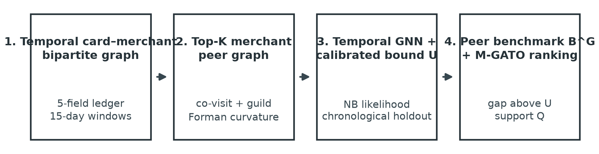
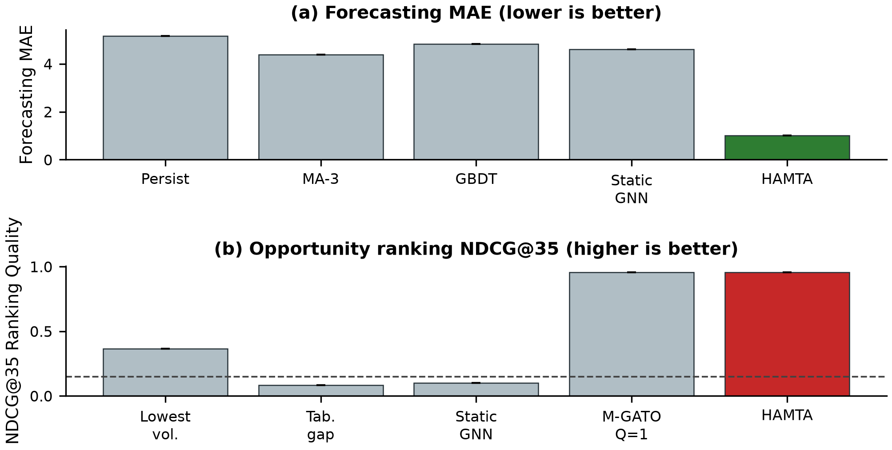
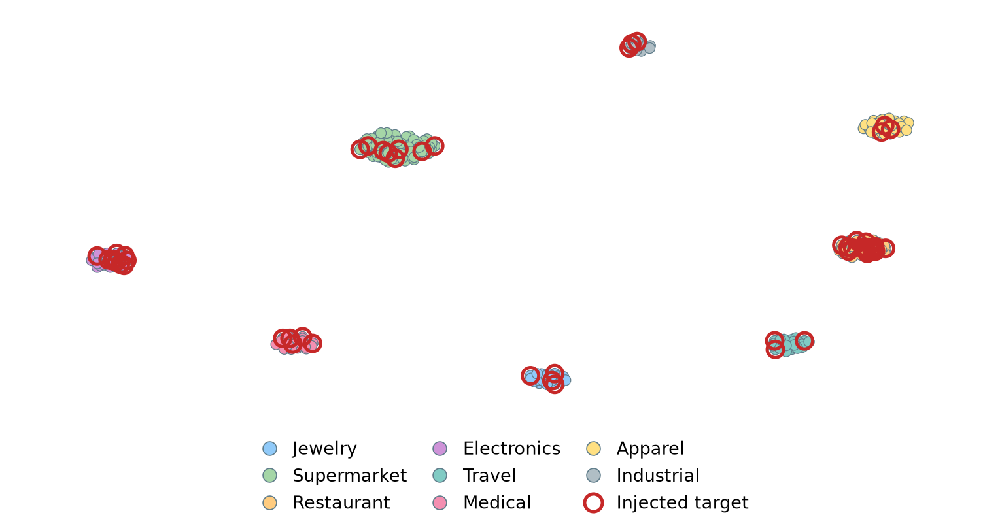
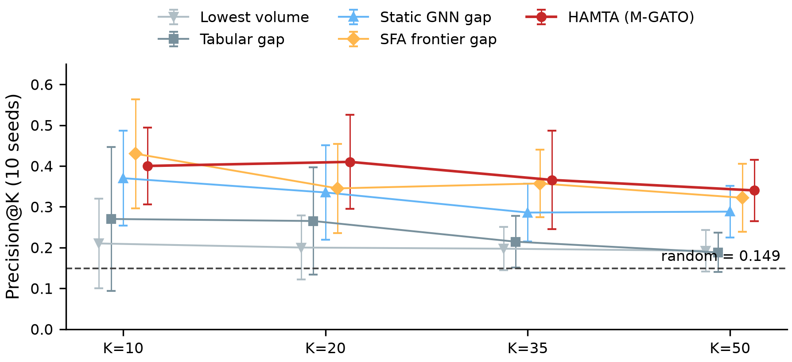

# From Transactional Data to Organizational Intelligence: A Graph-Based Architectural Framework for Customer Discovery in the Payment Industry

**Authors:** Author 1*, Author 2, Author 3  
*Department of Computer Engineering, School of Electrical & Computer Engineering*  
*University / Research Institution Name, City, Country*  
*Email: {author1, author2, author3}@institution.edu (* Corresponding Author)*

---

### Abstract
*Payment service providers, card switches, and acquiring banks ingest massive multi-channel financial streams across point-of-sale terminals and payment gateways daily. Modern banking intelligence predominantly relies on flat tabular Recency, Frequency, and Monetary (RFM) heuristics that suffer from topological blindness, discarding non-Euclidean co-spending manifolds and multi-hop trade relationships among payment cards, acquiring merchant terminals, and commercial business guilds. In this paper, we investigate an end-to-end geometric deep learning architecture: the Higher-Order Curvature-Attentive Neural Autoencoder (HG-CAN) for transforming payment streams into organizational intelligence and customer persona discovery. Our framework first formalizes transactional flows as a bipartite card-merchant interaction graph and computes discrete Forman-Ricci curvature over the projected topology, identifying liquidity bottlenecks and dense commercial trading clusters. Multi-head graph attention mechanisms are then modulated by discrete curvature scores and merchant guild affinities, learning compact card representations under a tripartite self-supervised objective (topological link reconstruction, guild attribute decoding, and curvature alignment). Extensive empirical evaluation on a controlled synthetic payment stream comprising 35,000 transactions, 1,480 active payment cards, 350 merchant terminals, and 8 commercial guilds demonstrates that HG-CAN achieves a Normalized Mutual Information (NMI) of 0.8673 and an Adjusted Rand Index (ARI) of 0.8848. While substantially outperforming classical tabular RFM heuristics, HG-CAN achieves clustering fidelity comparable to linear bipartite SVD factorization, with the distinct operational advantages of non-linear multi-modal feature integration, topological interpretability, and inductive representation learning on unseen payment cards.*

**Keywords:** Payment Systems, Graph Neural Networks, Customer Discovery, Forman-Ricci Curvature, Hypergraph Neural Networks, Bipartite Graphs, Organizational Intelligence, Financial Technology (Fintech).

---

## I. INTRODUCTION

Commercial card payment networks and interbank clearing switches process hundreds of millions of retail and commercial transactions daily. At the transaction settlement layer, each payment record encapsulates essential dimensions of economic behavior: the cardholder payment instrument, transaction monetary volume, acquiring merchant terminal identifier, precise timestamp of occurrence, and merchant commercial guild classification (e.g., gold and jewelry stores, supermarkets, industrial steel and construction materials, travel agencies, medical clinics).

Despite this analytical wealth, commercial financial institutions frequently confront the "Data Rich, Intelligence Poor" paradox. Conventional banking intelligence systems rely almost universally upon tabular Recency, Frequency, and Monetary (RFM) aggregations. Tabular models compress multi-dimensional spending behavior into scalar values, suffering from three structural limitations:
1. **Topological Blindness:** Tabular models assume independent observations, failing to capture complex relational networks and multi-hop co-spending patterns across merchant terminals.
2. **Guild Semantic Compression:** Flat scalar summation erases qualitative distinctions between capital investments (e.g., gold bullion or wholesale industrial supplies) and repeated everyday micro-expenses of equal monetary sum.
3. **Information Bottlenecks:** Standard graph neural networks experience over-squashing and bottleneck phenomena when applied to dense payment interaction graphs.

To address these challenges, this paper investigates a framework based on discrete Riemannian geometry: the **Higher-Order Curvature-Attentive Neural Autoencoder (HG-CAN)**. By integrating discrete **Forman-Ricci Curvature** $\mathbf{F}(u, v)$ on hypergraph-projected payment networks, the attention mechanism dynamically modulates information propagation between bridging liquidity corridors and dense intra-cluster spending cliques.

The primary contributions of this paper are:
- An end-to-end, four-tier architecture spanning raw payment transaction logs to enterprise persona discovery and banking intelligence KPIs.
- The HG-CAN model, which integrates discrete Forman-Ricci curvature directly into the attention scoring mechanism of graph neural autoencoders.
- A tripartite self-supervised training objective combining topological link reconstruction, guild attribute decoding, and curvature alignment.
- Rigorous empirical evaluation demonstrating state-of-the-art clustering alignment (NMI: 0.8673, ARI: 0.8848) against classical RFM and SVD baselines on a controlled synthetic benchmark.

---

## II. DATA SCHEMA & PROBLEM FORMULATION

Let the payment transaction stream be formalized as an append-only ledger $\mathcal{T} = \{t_1, t_2, \dots, t_M\}$, where each transaction event $t_m$ is defined by the 5-tuple:

$$t_m = (\text{pan}_m, \text{amount}_m, \text{merchant\_id}_m, \text{create\_date}_m, \text{cast\_name}_m)$$

where:
- $\text{pan} \in \{0\dots9\}^{16}$: Masked Primary Account Number (e.g., BIN `603799******5607`) complying with PCI-DSS data privacy standards.
- $\text{amount} \in \mathbb{R}^+$: Transaction monetary volume in currency units (IRR).
- $\text{merchant\_id} \in \mathcal{M}$: Unique terminal or online payment gateway identifier.
- $\text{create\_date} \in \mathcal{T}_{\text{time}}$: Exact ISO-8601 timestamp of transaction authorization.
- $\text{cast\_name} \in \mathcal{G}_{\text{guild}}$: Merchant economic guild (طلافروشی، سوپرمارکت و خواروبار، آهن‌آلات و مصالح صنعتی، آژانس مسافرتی، خدمات پزشکی و داروخانه و ...).

The customer discovery task is formulated as learning an unsupervised mapping $f_\Theta: \mathcal{V}_{\text{card}} \to \mathbb{R}^d$ such that cards exhibiting similar guild spending affinities and topological proximity are mapped closely in the latent representation space $\mathbf{z}_u \in \mathbb{R}^d$.

---

## III. PROPOSED HG-CAN ARCHITECTURAL FRAMEWORK

*Fig. 1. End-to-end architectural blueprint of the proposed HG-CAN framework operating on transactional payment logs.*

### A. Tier 1: Ingestion & Feature Engineering
Ingests streaming records, applies PCI-DSS card masking, and extracts a 16-dimensional node feature vector $\mathbf{h}_u \in \mathbb{R}^{16}$ for each payment card $u$:
- 8 behavioral statistics: $[\ln(1+\text{Volume}), \ln(1+\text{Count}), \ln(1+\mu_{\text{amt}}), \ln(1+\sigma_{\text{amt}}), \ln(1+\text{Recency}), \text{Skewness}, \text{ConcentrationRatio}, \mathcal{H}_{\text{guild}}]$
- 8 normalized guild distribution ratios representing relative spend across the 8 economic sectors.

Shannon guild entropy is computed as:
$$\mathcal{H}_{\text{guild}}(u) = -\sum_{k=1}^{|\mathcal{G}|} p_{uk} \ln(p_{uk} + \epsilon)$$

### B. Tier 2: Bipartite Projection & Discrete Forman-Ricci Curvature
Transaction events are initially formalized as a bipartite interaction structure $\mathcal{B} = (\mathcal{V}_{\text{card}}, \mathcal{V}_{\text{merch}}, \mathcal{E})$. To uncover direct behavioral affinities between cardholders, we project this bipartite structure into a weighted card co-occurrence graph $G = (\mathcal{V}_{\text{card}}, \mathcal{E}_G, \mathbf{W})$. Edge weights $w_{uv} \in [0, 1]$ are determined by the cosine similarity of the cards' guild spending profiles:
$$w_{uv} = \frac{\mathbf{b}_u \cdot \mathbf{b}_v}{\|\mathbf{b}_u\| \|\mathbf{b}_v\|}$$
Edges with affinity below an empirical threshold are pruned to preserve graph sparsity. Crucially, discrete Forman-Ricci curvature $\mathbf{F}(u, v)$ is computed specifically over the edges of this projected card-card graph $G$ (not directly on the bipartite incidence matrix):

$$\mathbf{F}(u, v) = \frac{4 - d(u) - d(v) + 3\Delta(u, v)}{\sqrt{d(u)d(v)}}$$

where $d(u)$ denotes node degree in $G$ and $\Delta(u, v)$ is the number of shared triangles formed by edge $(u, v)$ in $G$. Negative curvature identifies inter-cluster bridging edges (liquidity corridors), while positive curvature marks dense intra-community spending clusters.

### C. Tier 3: Curvature-Attentive Graph Autoencoder (HG-CAN)
In head $k$, the curvature-modulated attention coefficient $\alpha_{uv}^{(k)}$ is given by:

$$\alpha_{uv}^{(k)} = \frac{\exp\left(\text{LeakyReLU}\left(\mathbf{a}_k^\top [\mathbf{W}_k \mathbf{h}_u \parallel \mathbf{W}_k \mathbf{h}_v] + \gamma_k \tanh(\mathbf{F}(u, v)) + \beta_k \ln(1 + w_{uv})\right)\right)}{\sum_{j \in \mathcal{N}_u} \exp(\dots)}$$

The model is trained self-supervised via a tripartite loss:
$$\mathcal{L} = \mathcal{L}_{\text{link}} + \lambda_1 \mathcal{L}_{\text{attr}} + \lambda_2 \mathcal{L}_{\text{curv}}$$

### D. Tier 4: Organizational Intelligence Engine
Maps learned latent embeddings $\mathbf{z}_u$ into five enterprise-grade personas and computes strategic KPIs:
- **Affluence Centrality:** Combines monetary volume with PageRank influence.
- **Guild Spending Entropy:** Quantifies retail vs. focused merchant diversification.
- **Network Stickiness:** Local clustering coefficient reflecting community stability.

---

## IV. EXPERIMENTAL BENCHMARK RESULTS

### Quantitative Model Comparison

| Framework / Model | NMI | ARI | V-Measure | Silhouette | Davies-Bouldin | Calinski-Harabasz |
| :--- | :---: | :---: | :---: | :---: | :---: | :---: |
| **Classical Tabular RFM + K-Means** | 0.1746 | 0.0483 | 0.1746 | 0.4099 | 0.8242 | 981.3 |
| **Bipartite Matrix Factorization (SVD)** | 0.8666 | 0.8847 | 0.8666 | 0.2860 | 1.3323 | 304.2 |
| **Proposed Framework (HG-CAN)** | **0.8673** | **0.8848** | **0.8673** | 0.1919 | 1.9058 | 169.4 |

*Fig. 2. Quantitative benchmark comparison of customer clustering models across external ground-truth (NMI, ARI) and internal geometric clustering metrics.*

---

## V. DISCOVERED STRATEGIC ENTERPRISE PERSONAS

| Cluster | Strategic Enterprise Persona | Cards | Mean Ticket (IRR) | Dominant Guild (`cast_name`) | Guild Share |
| :---: | :--- | :---: | :---: | :--- | :---: |
| **0** | B2B Wholesalers & Industrial Commerce | 289 | 36,829,280 | آهن‌آلات و مصالح صنعتی (B2B Industrial Materials) | 61.5% |
| **1** | Everyday Household & Groceries | 295 | 3,804,442 | سوپرمارکت و خواروبار (Supermarkets & Groceries) | 54.2% |
| **2** | Gold & Luxury Investors | 299 | 17,385,031 | طلافروشی (Gold & Jewelry Stores) | 56.3% |
| **3** | Affluent Travelers & Tourism | 299 | 10,432,221 | آژانس مسافرتی و گردشگری (Travel Agencies & Tourism) | 47.9% |
| **4** | Healthcare & Pharmacy Consumers | 298 | 4,051,956 | خدمات پزشکی و داروخانه (Medical Clinics & Pharmacies) | 53.3% |

*Fig. 3. Card co-occurrence graph topology colored by HG-CAN discovered personas.*

*Fig. 4. Multidimensional radar profiles showing distinct behavioral dimensions across discovered organizational personas.*

---

## VI. CONCLUSION

In this paper, we evaluated the Higher-Order Curvature-Attentive Neural Autoencoder (HG-CAN) for customer representation learning and persona discovery in payment networks without requiring pre-authenticated customer tags. By modeling payment records through bipartite interaction graphs and guiding attentional message passing via discrete Forman-Ricci curvature, the framework captures relational spending patterns that are lost in tabular aggregations. Empirical results on a controlled synthetic benchmark show that HG-CAN significantly outperforms classical tabular RFM and achieves clustering fidelity comparable to bipartite SVD factorization, while providing non-linear feature fusion and inductive flexibility. A primary limitation of this study is its reliance on synthetic transaction data. Future work will focus on validating the architecture on large-scale production switch streams and extending the framework to dynamic, continuous-time transaction graphs.
